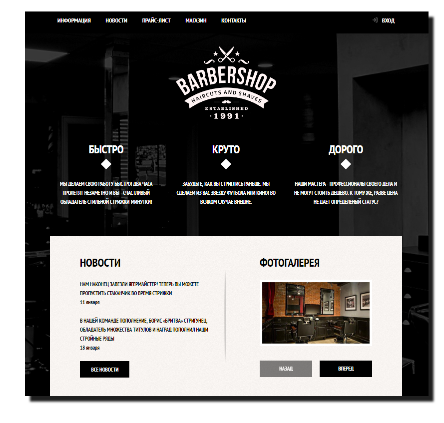
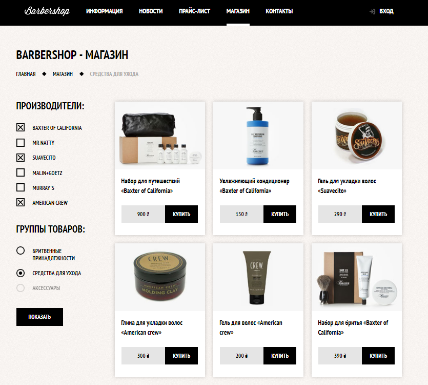
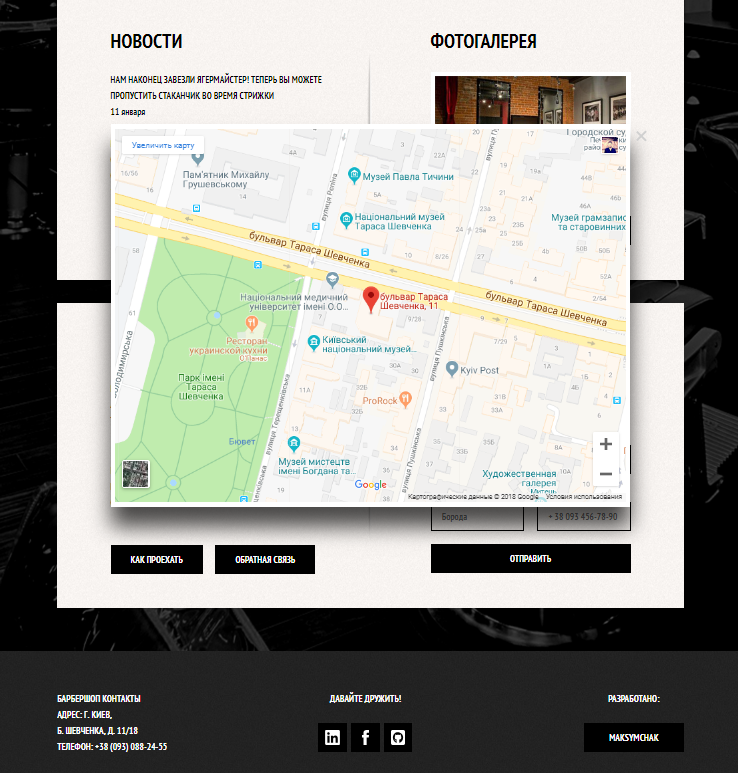

# Barbershop

Barbershop is an incredible website for barbers and those who need an easy, attractive and effective way to share their work with clients. It has purpose oriented design, responsive layout and special features -  3 different pages, pricing tables, shop, product page. Check out the demo of the website here: [Barbershop Live Preview](https://maksymchak.github.io/barbershop/)

# Features:

* HTML5 and CSS3
* Customizable & Organized
* Multi Page
* Flexible & Multipurpose
* Responsive
* Unique & Modern Design

We are living in a digital era and in the changing times, businesses need to buckle up to sustain or become irrelevant with time. Gone are the days when business cards used to be the mode of your information and contact. Today, websites serve the same purpose in a more attractive fashion. 

## Misc

Follow Me: [LinkedIn](https://www.linkedin.com/in/anton-maksymchak/), [Facebook](https://www.facebook.com/Anton.Maksymchak), [GitHub](https://github.com/maksymchak)

©[Anton Maksymchak](https://github.com/maksymchak) 2018

